<div align="center">



<a href="https://github.com/Muyubu1"></a>

<br/><br/>

[](https://www.linkedin.com/in/yusuf-bulut-5a9348323/)
[](mailto:yusufbulutm@gmail.com)
[](https://vespay.com.tr/)
[](https://drive.google.com/file/d/1cExfGw_JDwkG5JInJ3vsbdVPzrV67vCz/view?usp=drivesdk)


</div>



### 🛰️ Pilot Profili

```text
╭──────────────────────────────────────────────────────────╮
│  PİLOT      : Muhammet Yusuf Bulut                       │
│  RÜTBE      : Bilgisayar Mühendisi                       │
│  ÜS         : Kocaeli / Çayırova  (Gebze · TOSB · GOSB)  │
│  AKADEMİ    : Düzce Üniversitesi — GPA 3.24 / 4.00       │
│  EĞİTİM     : Siber Vatan Programı Mezunu                │
│  UZMANLIK   : Full Stack · Backend · Dağıtık Sistemler   │
│  DURUM      : 🟢 GÖREVDE — yeni misyonlara açık          │
╰──────────────────────────────────────────────────────────╯
```

- 🎓 **Düzce Üniversitesi Bilgisayar Mühendisliği** mezunuyum (Lisans GPA: **3.24 / 4.00**).
- 📍 **Kocaeli / Çayırova** bölgesinde ikamet ediyorum (Gebze, TOSB, GOSB ve Teknopark İstanbul aksına yakın).
- 💻 **Modern Web & Dağıtık Sistemler**: Next.js 14, TypeScript, Go (Golang), C# / .NET ve PostgreSQL odaklı ölçeklenebilir ve yüksek performanslı mimariler kuruyorum.
- 💳 **FinTech & SaaS Mimarisi**: Fiziksel donanım (Web NFC) entegrasyonuna, çok kiracılı (*multi-tenant*) veri izolasyonuna ve atomik finansal işlem (*$transaction*) güvenliğine sahip canlı SaaS platformu inşa edip ticarileştirdim.
- ⚡ **Telemetri & Endüstriyel Sistemler**: Elektrik sayaçlarından ve saha sensörlerinden veri toplayıp asenkron ayrıştıran ve otomatik faturalandıran sunucu mimarileri (*TP_Server*) geliştirdim.
- 🛡️ **Siber Vatan** programı mezunuyum; kurumsal Linux sistem yönetimi, ağ temelleri ve güvenli yazılım prensiplerine hâkimim.


### 🧰 Gemi Ekipmanı — Teknolojiler & Yetkinlikler

<div align="center">

#### 🌌 Diller & Temel Teknolojiler


-00ADD8?style=for-the-badge&logo=go&logoColor=white)


#### 🛸 Frontend & Mobil


#### ⚙️ Backend, Veritabanı & Sistemler


#### 🛰️ DevOps, Bulut & Araçlar


-F80000?style=for-the-badge&logo=oracle&logoColor=white)


</div>


### 🪐 Keşfedilen Gezegenler — Öne Çıkan Projeler

<table>
  <tr>
    <td width="50%" valign="top">
      <h3 align="center">💳 VesPay — SaaS FinTech Platformu</h3>
      <p align="center">
        <b>Çok Kiracılı (Multi-Tenant) Bakiye & Temassız Ödeme Ekosistemi (Canlı / Ticari Satış)</b>
      </p>
      <ul>
        <li><b>Teknolojiler:</b> Next.js 14, TypeScript, Go (Golang), PostgreSQL 15, Prisma, Docker, OCI.</li>
        <li><b>Multi-Tenancy:</b> Kurum bazlı dinamik şema izolasyonu ve tenant seviyesinde erişim güvenliği.</li>
        <li><b>NFC Donanım:</b> Fiziksel NFC kartlar üzerinden temassız bakiye düşme akışı (Web NFC PWA & Flutter).</li>
        <li><b>Atomik İşlemler:</b> Finansal veri tutarlılığı için bakiye transferlerinde <code>$transaction</code> mimarisi.</li>
        <li><b>Go Mikroservisi:</b> Düşük bellek (~20MB RAM) tüketen asenkron bildirim ve rate limiter kuyruğu.</li>
      </ul>
      <p align="center">
        <a href="https://vespay.com.tr/">🌐 <b>Canlı Platformu İncele</b></a> • 
        <a href="https://github.com/Muyubu1/VesPay">📂 <b>GitHub Reposu</b></a>
      </p>
    </td>
    <td width="50%" valign="top">
      <h3 align="center">⚡ TP_Server — Sayaç Telemetri Servisi</h3>
      <p align="center">
        <b>Akıllı Sayaç Telemetrisi & Otomatik Faturalandırma Sunucusu (Lisans Tezi)</b>
      </p>
      <ul>
        <li><b>Teknolojiler:</b> C#, .NET, TCP/IP, PostgreSQL / MSSQL, Docker.</li>
        <li><b>Telemetri Ayrıştırma:</b> Elektrik sayaçlarından gelen anlık ve periyodik telemetri paketlerini toplayan ve ayrıştıran yüksek performanslı sunucu servisi.</li>
        <li><b>Doğrulama Hattı:</b> Hatalı ve eksik paketleri süzen asenkron veri doğrulama filtreleri.</li>
        <li><b>Otomatik Faturalandırma:</b> Tüketim endeksleri üzerinden tarife hesaplama ve dinamik ekstre motoru.</li>
      </ul>
      <p align="center">
        <a href="https://github.com/Muyubu1/TP_Server">📂 <b>GitHub Reposu</b></a>
      </p>
    </td>
  </tr>
</table>


### 📬 İletişim Frekansı

<div align="center">

[](tel:+905349874757)
[](mailto:yusufbulutm@gmail.com)
[](https://www.linkedin.com/in/yusuf-bulut-5a9348323/)

<br/>


</div>
